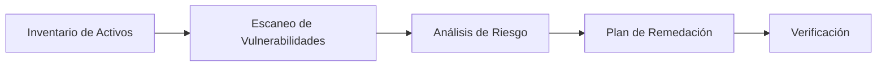

## 🔐 La Tríada CIA

| Componente | Descripción | Mecanismos de Protección |
|------------|-------------|--------------------------|
| **Confidencialidad** | Solo usuarios autorizados pueden acceder a los datos | Cifrado, políticas de acceso, IAM, principio de mínimo privilegio |
| **Integridad** | Los datos no pueden ser alterados indebidamente | Hash, firmas digitales, control de cambios, logs |
| **Disponibilidad** | Los recursos son accesibles cuando se necesitan | Monitorización, planes de contingencia, redundancia |

## 🚨 Amenazas Comunes

### Principales Categorías
- **Malware/Ransomware** - Afecta toda la tríada CIA
- **Phishing** - Compromete confidencialidad
- **DDoS** - Compromete disponibilidad
- **Errores humanos** - Puede afectar toda la tríada CIA

## 🛡️ Prevención Básica

### Medidas Esenciales
- ✅ **Actualizaciones constantes** de software
- ✅ **Gestores de contraseñas** (KeePass)
- ✅ **Sistemas de monitorización** (Zabbix)
- ✅ **Inventario de activos** (GLPI/Snipe-IT)

## 📋 Vulnerabilidades Más Comunes

1. **Contraseñas débiles**
2. **Software desactualizado**
3. **Configuraciones inseguras**

## 🔄 Pipeline de Gestión de Vulnerabilidades

**Herramientas recomendadas:**
- **Inventario**: GLPI/Snipe-IT
- **Escaneo**: Nessus
- **Análisis**: Evaluación de impacto
- **Remediación**: Parches y configuraciones
- **Verificación**: Re-escaneo y pruebas

## 📚 Glosario de Términos

### 🦠 Tipos de Malware

| Tipo | Descripción |
|------|-------------|
| **Virus** | Se auto-inyecta en archivos y se propaga al ejecutarlos |
| **Worm** | Se autoreplica en la red sin necesidad de archivo huésped |
| **Trojan** | Se disfraza de software legítimo |
| **Ransomware** | Cifra archivos y exige rescate |
| **Rootkit** | Oculta su presencia y mantiene privilegios elevados |
| **Spyware** | Recopila información del usuario |
| **Adware** | Muestra publicidad no deseada |
| **Botnet** | Red de equipos comprometidos controlados remotamente |
| **Fileless** | Opera en memoria RAM sin dejar rastro en disco |

### 🔧 Malware Especializado
- **RAT**: Control remoto del equipo víctima
- **Keylogger**: Registra pulsaciones de teclado
- **Backdoor**: Acceso persistente al sistema
- **Dropper**: Descarga e instala otro malware
- **Bootkit**: Infecta el proceso de arranque
- **Firmware**: Infecta BIOS/UEFI para persistencia profunda

## 🌐 Ataques a Redes

### Ataques de Denegación de Servicio
- **DDoS**: Sobrecarga de tráfico
- **SYN Flood**: Consumo de conexiones TCP incompletas
- **Smurf**: Uso de broadcast ICMP para amplificación

### Ataques de Suplantación e Interceptación
- **ARP Spoofing/Poisoning**: Engaña tablas ARP para interceptar tráfico
- **IP Poisoning**: Falsificación de IP origen
- **Packet Sniffing**: Captura de tráfico de red
- **MITM**: Interceptación de comunicaciones
- **Session Hijacking**: Secuestro de sesiones activas

### Ataques a Protocolos
- **TCP/IP Fragmentation**: Paquetes malformados para causar fallos
- **Port Scanning**: Búsqueda de puertos y vulnerabilidades
- **DNS/Cache Poisoning**: Corrupción de resolución DNS
- **DNS Hijacking**: Secuestro de resolución DNS
- **BGP Hijacking**: Secuestro de rutas de internet

## 🕸️ Ataques a Aplicaciones Web

### Inyecciones y Ejecución de Código
- **SQL Injection**: Inyección de comandos SQL
- **Blind SQLI**: SQL Injection sin respuesta directa
- **XSS**: Ejecución de scripts en navegadores de víctimas
- **CSRF**: Ejecución de acciones no autorizadas
- **LFI/RFI**: Inclusión de archivos locales/remotos
- **Path Traversal**: Acceso a directorios no autorizados

### Otros Ataques Web
- **Insecure Deserialization**: Ejecución de código mediante deserialización
- **SSRF**: Peticiones forzadas desde el servidor
- **Clickjacking**: Engaño en interfaces de usuario
- **Broken Authentication**: Fallos en autenticación
- **Open Redirect**: Redirecciones maliciosas

## 👤 Ataques a Identidad y Acceso

### Phishing y Ingeniería Social
| Tipo | Objetivo |
|------|----------|
| **Phishing** | Robo genérico de credenciales |
| **Spear Phishing** | Objetivos específicos |
| **Whaling** | Altos ejecutivos |
| **Vishing** | Por voz (teléfono) |
| **Smishing** | Por SMS |

### Ataques a Credenciales
- **Credential Stuffing**: Uso de credenciales filtradas
- **Password Spraying**: Contraseñas comunes contra múltiples cuentas
- **Brute Force**: Prueba masiva de contraseñas
- **Password Cracking**: Descifrado de hashes
- **Session Fixation**: Fijación de sesión para secuestro

### Técnicas Avanzadas
- **SIM Swapping**: Secuestro de número telefónico
- **Account Takeover**: Toma de control de cuentas
- **BEC**: Compromiso de correo empresarial
- **Privilege Escalation**: Obtención de mayores permisos

## 🎭 Ingeniería Social

### Técnicas Principales
- **Pretexting**: Inventar excusas para obtener información
- **Baiting**: Ofrecer incentivos para infectar sistemas
- **Quid Pro Quo**: Ofrecer servicios a cambio de información
- **Tailgating**: Acceso físico siguiendo a personas autorizadas
- **Impersonation**: Suplantación de identidad

## 🏢 Amenazas Internas

### Tipos de Insider Threats
- **Malicious Insider**: Empleado con intenciones maliciosas
- **Negligent Insider**: Errores humanos por descuido
- **Compromised Insider**: Cuentas legítimas tomadas por atacantes externos

## ⛓️ Amenazas a la Cadena de Suministro

### Vectores de Ataque
- **Software Supply Chain**: Compromiso de paquetes legítimos
- **Hardware Supply Chain**: Componentes maliciosos en hardware
- **Third Party Service**: Ataques a través de proveedores

## ☁️ Amenazas en Cloud y Virtualización

### Riesgos Comunes
- **Misconfiguration**: Configuraciones incorrectas que exponen datos
- **Privilege Escalation**: Escalada de privilegios en entornos cloud
- **Credential Leakage**: Fugas de claves API
- **VM Escape**: Escape de máquinas virtuales al hipervisor
- **Side Channel**: Extracción de información mediante infraestructura compartida
- **Abuse of Services**: Uso malicioso de recursos cloud

## 📱 Ataques a Móviles e IoT

### Dispositivos Móviles
- **Mobile Malware**: Apps maliciosas que roban datos
- **App Sideloading**: Instalación de apps fuera de tiendas oficiales
- **Malicious QR Codes**: Códigos QR maliciosos
- **Bluetooth Attacks**: Explotación de servicios Bluetooth
- **NFC Skimming**: Clonación de tarjetas mediante NFC

### Dispositivos IoT
- **Default Credentials**: Uso de credenciales por defecto
- **IoT Botnets**: Redes de dispositivos IoT para DDoS

## 🎯 Ataques Dirigidos y Persistentes

### Tácticas Avanzadas
- **APT**: Operaciones largas y sofisticadas de espionaje
- **Watering Hole**: Compromiso de sitios web frecuentados por objetivos
- **Living off the Land**: Uso de herramientas legítimas del sistema
- **Lateral Movement**: Movimiento lateral dentro de redes
- **Reconnaissance**: Recopilación de información previa al ataque

## 🏭 Ataques a Sistemas Industriales

### Amenazas Específicas
- **ICS Attacks**: Malware que afecta controladores industriales
- **Protocol Abuse**: Explotación de protocolos industriales inseguros
- **Physical Sabotage**: Manipulación física de equipos industriales

## 🔒 Amenazas Físicas

### Riesgos Físicos
- **Robo de Dispositivos**: Pérdida física de equipos
- **Eavesdropping Físico**: Observación directa de credenciales
- **Hardware Tampering**: Modificación maliciosa de hardware
- **Evil Maid Attack**: Acceso físico temporal para infectar equipos

## 🔐 Ataques Criptográficos

### Técnicas de Ataque
- **Brute Force**: Fuerza bruta contra criptografía
- **Dictionary Attack**: Ataque con diccionarios precomputados
- **Birthday Attack**: Explotación de colisiones en funciones hash
- **Replay Attack**: Repetición de comunicaciones válidas
- **Downgrade Attack**: Forzar protocolos menos seguros
- **Side-Channel**: Extracción de claves mediante fugas físicas

## 💰 Fraude y Manipulación

### Técnicas de Engaño
- **BEC**: Engaños por correo para transferencias fraudulentas
- **Invoice Fraud**: Facturas falsas para cobros ilegítimos
- **Fake Apps**: Aplicaciones falsas para robo de información

## 🎯 Explotación de Vulnerabilidades

### Términos Clave
- **Zero-Day**: Vulnerabilidad desconocida sin parche disponible
- **Exploit Chaining**: Combinación de múltiples vulnerabilidades
- **Proof of Concept**: Uso malicioso de PoCs públicos

## 💥 Ataques Contra Disponibilidad

### Técnicas Destructivas
- **Wiper Malware**: Borrado o daño irreversible de datos
- **Ransom DoS**: Combinación de extorsión con ataques de denegación
- **Operational Sabotage**: Manipulación de procesos operativos

## 🕵️ Técnicas de Evasión

### Métodos de Ocultación
- **Polymorphic/Metamorphic**: Cambio de código para evadir detección
- **Anti-VM/Anti-Debugging**: Detección de entornos de análisis
- **TLS Misuse**: Ocultación en tráfico cifrado legítimo

## 💸 Malware Financiero

### Amenazas Monetarias
- **Banking Trojans**: Robo de credenciales bancarias
- **Card Skimming**: Captura de datos de tarjetas
- **Cryptojacking**: Minería no autorizada de criptomonedas

## ⚖️ Amenazas Legales y Operacionales

### Riesgos de Cumplimiento
- **Data Leakage**: Exposición accidental de datos sensibles
- **Privacy Violations**: Violaciones de privacidad
- **Regulatory Non-Compliance**: Incumplimiento normativo

## 🔍 Técnicas de Post-Explotación

### Movimiento Lateral
- **Credential Harvesting**: Recolección masiva de credenciales
- **Pass-the-Hash**: Uso de hashes para autenticación
- **Kerberoasting**: Ataques a Kerberos en entornos Windows
- **Golden Ticket**: Tickets Kerberos falsos para acceso persistente

## 🚀 Amenazas Emergentes

### Tecnologías Futuras
- **Deepfake**: Manipulación de audio/video
- **AI-Assisted Attacks**: Ataques asistidos por inteligencia artificial
- **Quantum Threats**: Futuro quebrantamiento de criptografía clásica
