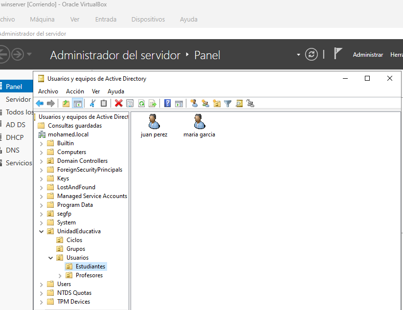
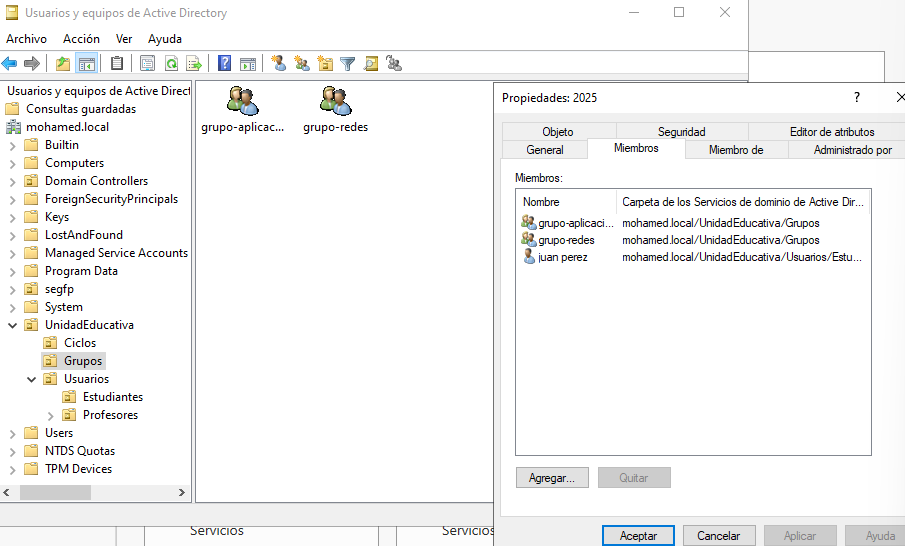

u    dueño                                                        r 4     leer        
g   grupo del dueño                                        w 2    escribir
o    otros                                                          x 1     ejecutar     

carpetas compartidas windows serv
predominan los permisos nfts

Get-Acl
para ver permisos en powershell
Set-Acl -AclObject $almacencontinepermios

**directorio activo**
1. maquina en puente
2. ping funciona
3. firewall desactivado
4. habilitar accesi remoto
5. conexion remoto y poner la ip de la maquina objetivo  desde el anfitrion
#### actividad
crear una estructura de clase con varios ciclos cursos y estudiantes solo crear la estructura
nueva unidad organizativa
grupos 
usuarios

